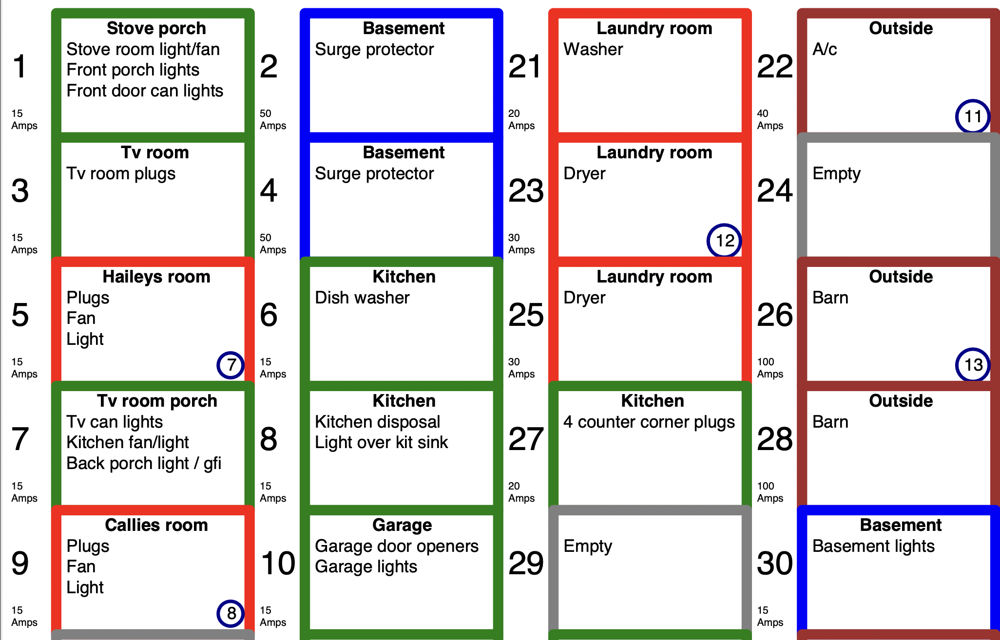

# Breaker Panel Labels

Make an easy to read label for your circuit breaker panel

Example output



Create a csv file using this format.  Separate the `circuits` cell with `;` to list multiple items.


| number |	amp	| circuits	| panel |	room	| floor |
| --- | ----------- | --- | ----------- | --- | ----------- |
| 1 | 30 |	water heater	| subpanel  |	basement    |	basement |
| 7 | 15 |	master bed room lights; master bed room plugs;  Master bath lights	| subpanel  |	master bed    |	2nd |


Text block version of the above
```csv
number,amp,circuits,panel,room,floor
1,30,water heater,subpanel,basement,basement,
7,15,master bed room lights; master bed room plugs;  Master bath lights,subpanel,master bed,2nd

```